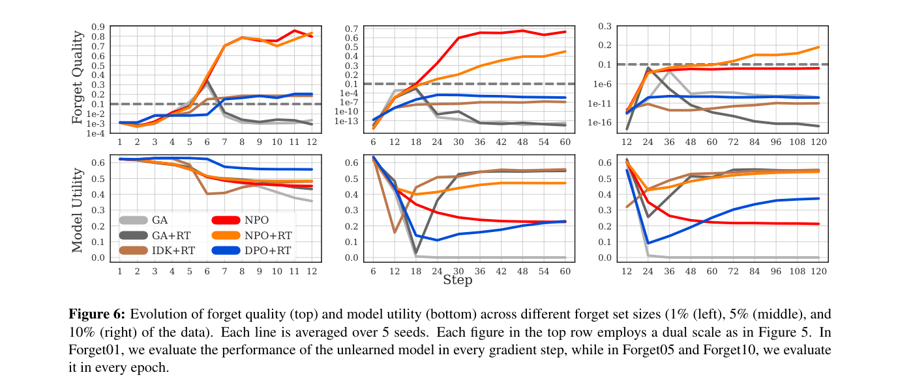

## Qué hace

Adapta el algoritmo DPO (Direct Preference Optimization) para machine unlearning, creando NPO (Negative Preference Optimization). Resuelve el problema del "colapso catastrófico" que ocurre con el ascenso de gradiente puro, donde el modelo pierde coherencia general.

---

## Metodología

### Funciones de pérdida componentes

El paper unifica todos los métodos evaluados como combinaciones lineales de cinco funciones de pérdida primitivas. Entender estas piezas es necesario para leer las combinaciones que siguen.

**$$\mathcal{L}_\text{GA}$$ — Gradient Ascent** ([Jang et al., 2022](2022_jang_knowledge-unlearning.html); [Yao et al., 2023](2023_yao_large-llm-unlearning.html))

$$\mathcal{L}_\text{GA}(\theta) = \mathbb{E}_{\mathcal{D}_\text{FG}}\bigl[\log \pi_\theta(y \mid x)\bigr]$$

Maximizar la log-probabilidad del forget set equivale a hacer gradient descent sobre la pérdida negativa de cross-entropy. La intuición es "revertir" el aprendizaje original. Problema: el gradiente tiene escala constante aunque el ejemplo ya esté olvidado — GA **diverge linealmente**, causando colapso catastrófico.

---

**$$\mathcal{L}_\text{FG}$$ — Forget loss** ([Maini et al., 2024](2024_maini_tofu.html); [Eldan & Russinovich, 2023](2023_eldan_harry-potter.html))

$$\mathcal{L}_\text{FG}(\theta) = -\mathbb{E}_{\mathcal{D}_\text{FG}}\bigl[\log \pi_\theta(\tilde{y} \mid x)\bigr]$$

Cross-entropy supervisada sobre el forget set pero con respuestas "desinformadas" $$\tilde{y} \neq y$$: puede ser "I don't know" (IDK) o una respuesta alternativa plausible pero incorrecta generada ad hoc. No usa gradient ascent, así que es estable. Usado en IDK+RT.

---

**$$\mathcal{L}_\text{RT}$$ — Retain loss** ([Maini et al., 2024](2024_maini_tofu.html))

$$\mathcal{L}_\text{RT}(\theta) = -\mathbb{E}_{\mathcal{D}_\text{RT}}\bigl[\log \pi_\theta(y \mid x)\bigr]$$

Cross-entropy estándar sobre el retain set. Anima al modelo a seguir respondiendo correctamente lo que no debe olvidar. Componente de retención más directa: penaliza explícitamente olvidar respuestas correctas en el retain set.

---

**$$\mathcal{K}_\text{RT}$$ — KL divergence on retain set** ([Maini et al., 2024](2024_maini_tofu.html))

$$\mathcal{K}_\text{RT}(\theta) = \mathbb{E}_{\mathcal{D}_\text{RT}}\bigl[D_\text{KL}(\pi_\theta(\cdot \mid x) \,\|\, \pi_\text{ref}(\cdot \mid x))\bigr]$$

Penaliza que la distribución del modelo actualizado se aleje de la del modelo de referencia, medido en el retain set. Más conservadora que $$\mathcal{L}_\text{RT}$$: no exige acertar las respuestas correctas, solo no cambiar la distribución. Corresponde al término "+KL" en las combinaciones. Usada en GA+KL, NPO+KL, DPO+KL.

---

**$$\mathcal{L}_\text{DPO}$$ — Direct Preference Optimization** ([Rafailov et al., 2023](2023_ermon_dpo.html))

$$\mathcal{L}_\text{DPO}(\theta) = -\frac{1}{\beta}\,\mathbb{E}\!\left[\log \sigma\!\left(\beta \log \frac{\pi_\theta(y_w \mid x)}{\pi_\text{ref}(y_w \mid x)} - \beta \log \frac{\pi_\theta(y_l \mid x)}{\pi_\text{ref}(y_l \mid x)}\right)\right]$$

Requiere pares $$(y_w, y_l)$$ para cada prompt. En unlearning, $$y_l$$ = respuesta original del forget set y $$y_w$$ = respuesta sintética generada aleatoriamente (Bernoulli(0.5)). El ruido en $$y_w$$ es una limitación respecto a NPO.

---

**$$\mathcal{L}_\text{NPO}$$ — Negative Preference Optimization** *(este paper)*

$$\mathcal{L}_\text{NPO}(\theta) = -\frac{2}{\beta}\,\mathbb{E}_{\mathcal{D}_\text{FG}}\!\left[\log \sigma\!\left(-\beta \log \frac{\pi_\theta(y \mid x)}{\pi_\text{ref}(y \mid x)}\right)\right]$$

La mitad negativa de $$\mathcal{L}_\text{DPO}$$: solo usa los ejemplos rechazados ($$y_l$$ = forget set), sin necesitar $$y_w$$. El peso adaptativo $$W_\theta = \frac{2\pi_\theta^\beta}{\pi_\theta^\beta + \pi_\text{ref}^\beta}$$ se vuelve automáticamente pequeño cuando el ejemplo ya está olvidado ($$\pi_\theta \ll \pi_\text{ref}$$), frenando el gradiente antes del colapso. Diverge **logarítmicamente** — exponencialmente más lento que $$\mathcal{L}_\text{GA}$$. Se reduce a $$\mathcal{L}_\text{GA}$$ cuando $$\beta \to 0$$.

---

### Métodos evaluados en los experimentos de TOFU

Todos los experimentos usan Llama-2-7B-chat, AdamW lr=1e-5, batch efectivo de 32, 10 épocas de unlearning.

En TOFU, el **forget set** son los pares QA sobre los autores ficticios a olvidar (2/10/20 autores según el split forget01/05/10); el **retain set** son los pares QA sobre los autores ficticios restantes (198/190/180 autores). Algunos métodos no usan retain set en absoluto; en los que sí lo usan, el retain set siempre son los pares QA de los autores no olvidados con sus respuestas correctas originales.

- **GA** — Minimiza $$\mathcal{L}_\text{GA}$$ solo ([Jang et al., 2022](2022_jang_knowledge-unlearning.html); [Yao et al., 2023](2023_yao_large-llm-unlearning.html)).
  *Forget:* QA de autores olvidados con sus respuestas correctas ($$y$$) — el modelo maximiza la pérdida sobre ellas.
  *Retain:* — (ningún término de retención).
  Colapsa rápidamente: alcanza su máximo forget quality en los primeros pasos y luego degenera de forma irreversible porque el gradiente de $$\mathcal{L}_\text{GA}$$ no se autoregula.

- **GA + RT** — Minimiza $$\mathcal{L}_\text{GA} + \mathcal{L}_\text{RT}$$.
  *Forget:* QA de autores olvidados con respuestas correctas (gradient ascent sobre ellas).
  *Retain:* QA de autores no olvidados con respuestas correctas (cross-entropy estándar para que el modelo siga respondiéndolas bien).
  El término $$\mathcal{L}_\text{RT}$$ frena el daño colateral, pero hereda la inestabilidad lineal de $$\mathcal{L}_\text{GA}$$: la degradación ocurre igual, solo más lento.

- **GA + KL** (abreviado "KL" en las figuras) — Minimiza $$\mathcal{L}_\text{GA} + \mathcal{K}_\text{RT}$$ ([Maini et al., 2024](2024_maini_kl-minimization.html)).
  *Forget:* QA de autores olvidados con respuestas correctas (gradient ascent).
  *Retain:* QA de autores no olvidados — no exige acertar las respuestas, solo que la distribución del modelo no se aleje de la del modelo de referencia (divergencia KL).
  Mismo problema de fondo que GA+RT: el ancla KL no basta para contener la divergencia lineal de $$\mathcal{L}_\text{GA}$$.

- **IDK + RT** — Minimiza $$\mathcal{L}_\text{FG} + \mathcal{L}_\text{RT}$$ ([Maini et al., 2024](2024_maini_tofu.html)).
  *Forget:* QA de autores olvidados, pero con $$\tilde{y}$$ = "I don't know" como respuesta objetivo — el modelo aprende a responder "no sé" en lugar de la respuesta correcta.
  *Retain:* QA de autores no olvidados con respuestas correctas (cross-entropy estándar).
  Estable porque no usa $$\mathcal{L}_\text{GA}$$. Sin embargo, solo suprime la respuesta directa sin tocar el conocimiento subyacente: ante parafraseo o ataques de extracción el conocimiento original resurge. Forget quality muy baja en los experimentos.

- **DPO** — Minimiza $$\mathcal{L}_\text{DPO}$$ ([Rafailov et al., 2023](2023_ermon_dpo.html)).
  *Forget:* QA de autores olvidados donde $$y_l = y$$ (respuesta correcta original) es el "perdedor" y $$y_w$$ = tokens aleatorios (Bernoulli(0.5)) es el "ganador" sintético.
  *Retain:* — (ningún término de retención).
  El ruido en $$y_w$$ introduce señal de aprendizaje degradada. Sin retención es inestable.

- **DPO + RT** — Minimiza $$\mathcal{L}_\text{DPO} + \mathcal{L}_\text{RT}$$.
  *Forget:* ídem DPO — respuesta correcta como perdedora, tokens aleatorios como ganadora.
  *Retain:* QA de autores no olvidados con respuestas correctas (cross-entropy estándar).
  El $$\mathcal{L}_\text{RT}$$ estabiliza el retain set, pero la mitad positiva ruidosa de $$\mathcal{L}_\text{DPO}$$ sigue limitando su rendimiento respecto a NPO+RT.

- **DPO + KL** — Minimiza $$\mathcal{L}_\text{DPO} + \mathcal{K}_\text{RT}$$.
  *Forget:* ídem DPO — respuesta correcta como perdedora, tokens aleatorios como ganadora.
  *Retain:* QA de autores no olvidados — solo divergencia KL respecto al modelo de referencia (sin exigir respuestas correctas).
  Misma limitación del ruido en $$y_w$$; retención más conservadora que DPO+RT.

- **KTO** — Minimiza $$\mathcal{L}_\text{KTO}$$ ([Ethayarajh et al., 2024](2024_ethayarajh_kto.html)).
  *Forget:* QA de autores olvidados con respuestas correctas, marcadas como "indeseables" en la función de valor de KTO — sin necesidad de construir un par ganador.
  *Retain:* — (ningún término de retención).
  Sin retención falla de forma similar a GA.

- **KTO + RT** — Minimiza $$\mathcal{L}_\text{KTO} + \mathcal{L}_\text{RT}$$.
  *Forget:* QA de autores olvidados marcados como indeseables (ídem KTO).
  *Retain:* QA de autores no olvidados con respuestas correctas (cross-entropy estándar).
  Más estable que KTO solo, pero queda por debajo de NPO+RT en todos los splits.

- **NPO** — Minimiza $$\mathcal{L}_\text{NPO}$$ solo.
  *Forget:* QA de autores olvidados con respuestas correctas — el log-ratio $$\log(\pi_\theta / \pi_\text{ref})$$ se minimiza, reduciendo la probabilidad del modelo actualizado relativa al de referencia. No necesita construir respuesta ganadora.
  *Retain:* — (ningún término de retención explícito, pero el denominador $$\pi_\text{ref}$$ actúa como ancla implícita).
  El peso adaptativo $$W_\theta$$ previene el colapso. Sin $$\mathcal{L}_\text{RT}$$ puede degradar el retain set con entrenamiento prolongado.

- **NPO + RT** *(propuesta principal)* — Minimiza $$\mathcal{L}_\text{NPO} + \mathcal{L}_\text{RT}$$.
  *Forget:* QA de autores olvidados con respuestas correctas (ídem NPO).
  *Retain:* QA de autores no olvidados con respuestas correctas (cross-entropy estándar).
  La estabilidad logarítmica de $$\mathcal{L}_\text{NPO}$$ se combina con $$\mathcal{L}_\text{RT}$$ que protege el retain set explícitamente. Única combinación que logra forget quality > 0.05 en Forget10 mientras preserva model utility. Domina la frontera de Pareto en todos los splits.

- **NPO + KL** — Minimiza $$\mathcal{L}_\text{NPO} + \mathcal{K}_\text{RT}$$.
  *Forget:* QA de autores olvidados con respuestas correctas (ídem NPO).
  *Retain:* QA de autores no olvidados — solo divergencia KL respecto al modelo de referencia (sin exigir respuestas correctas).
  Resultados muy similares a NPO+RT; ambos superan todas las variantes de GA y KTO.

### Figura 6: evolución durante el entrenamiento

*Figura 6 del paper — Evolución de forget quality (arriba) y model utility (abajo) a lo largo del entrenamiento para los tres tamaños de forget set (1%, 5%, 10%). GA y GA+RT alcanzan su pico de forget quality en los primeros pasos y luego colapsan irreversiblemente. NPO y NPO+RT alcanzan una meseta estable y la mantienen.*

---

## Datasets utilizados

- **TOFU**: autores ficticios, el benchmark principal.
- **WMDP**: conocimiento peligroso.
- Evaluación general con MMLU y perplexity sobre texto estándar.

---

## Ejemplo ilustrativo

Gradient ascent puro es como intentar desaprender a manejar diciéndole al cerebro "haz lo opuesto de todo lo que sabes de conducción" — el resultado podría ser un caos total, incluyendo olvidar cómo caminar. NPO sería más como: "olvida específicamente las rutas del vecindario X, pero mantén todo el resto de conocimiento de conducción intacto". El modelo de referencia actúa como el "resto del conocimiento de conducción".

---

## Resultados principales

- NPO supera al gradient ascent en TOFU: mejor forget quality con mucho menor degradación del modelo.
- La degradación en MMLU (capacidades generales) con NPO es típicamente menor al 5%, versus 20-30% con gradient ascent agresivo.
- Es más lento que gradient ascent (requiere el modelo de referencia para computar el término de regularización) pero mucho más estable.
- Mejor que métodos de fine-tuning estándar (gradient difference) en forget quality sin sacrificar retain accuracy.

---

## Ventajas respecto a trabajos anteriores

- Primer método que resuelve el colapso catastrófico del gradient ascent de forma teóricamente motivada.
- La conexión con DPO abre la puerta a aprovechar toda la infraestructura de entrenamiento con preferencias para unlearning.
- Proporciona un balance mucho mejor entre olvidar y retener.

---

## Trabajos previos relacionados

El paper agrupa los trabajos previos en tres áreas: (1) métodos de unlearning clásicos basados en gradient ascent para clasificadores, (2) métodos de unlearning específicos para LLMs, y (3) el framework de RLHF/DPO del que deriva NPO. Para los benchmarks de evaluación, destaca TOFU como benchmark principal adoptado en el paper.

- **Cao & Yang (2015) — Machine Unlearning**: [Machine Unlearning](2015_cao_machine-unlearning.html): trabajo fundacional que introduce machine unlearning; NPO surge como respuesta a sus limitaciones de escalabilidad a LLMs.
- **Jang et al. (2022) — Knowledge Unlearning**: [Knowledge Unlearning](2022_jang_knowledge-unlearning.html): propone gradient ascent (GA) como método de unlearning para LLMs; NPO demuestra superarlo al evitar el colapso catastrófico que GA produce.
- **Yao et al. (2023) — Large Language Model Unlearning**: [Large Language Model Unlearning](2023_yao_large-llm-unlearning.html): otro método basado en GA para LLMs que sirve como baseline de comparación directa.
- **Eldan & Russinovich (2023) — Who's Harry Potter?**: [Who's Harry Potter?](2023_eldan_harry-potter.html): propone generar muestras positivas con prompts diseñados para fine-tuning; método complementario y alternativo al enfoque de NPO.
- **Maini et al. (2024) — TOFU**: [TOFU](2024_maini_tofu.html): introduce el benchmark de autores ficticios que NPO adopta como evaluación principal de sus experimentos.
- **Rafailov et al. (2024) — Direct Preference Optimization (DPO)**: [DPO](2023_ermon_dpo.html): el algoritmo de alineamiento del que NPO toma directamente su formulación matemática, usando sólo la mitad "negativa" del objetivo de DPO.
- **Bai et al. (2022) — RLHF Assistant**: [RLHF Assistant](2022_bai_rlhf-assistant.html): trabajo clave en RLHF que motiva la conexión entre alineamiento con preferencias y unlearning que NPO explora.
- **Li et al. (2024) — WMDP**: [WMDP](2024_li_wmdp.html): propone el benchmark de conocimiento peligroso utilizado como segunda evaluación de NPO junto a TOFU.
- **Lynch et al. (2024) — Eight Methods**: [Eight Methods](2024_lynch_eight-methods.html): propone ocho métricas robustas para evaluar unlearning incluyendo resistencia a jailbreaks, evaluación adoptada en el paper.
- **Ethayarajh et al. (2024) — [KTO: Model Alignment as Prospect Theoretic Optimization](2024_ethayarajh_kto.html)**: método de alineamiento con datos no pareados (ejemplos individuales deseables/indeseables) basado en la teoría prospectiva de Kahneman-Tversky; evaluado como baseline en los experimentos de TOFU donde KTO+RT queda por debajo de NPO+RT.
- **Patil et al. (2023) — Sensitive Information**: [Sensitive Information](2023_patil_sensitive-information.html): método de ataque para extraer datos de modelos unlearned, relevante para evaluar si NPO es resistente a ataques de extracción.

## Tags

`machine-unlearning` `DPO` `optimización` `LLM` `colapso-catastrófico`
